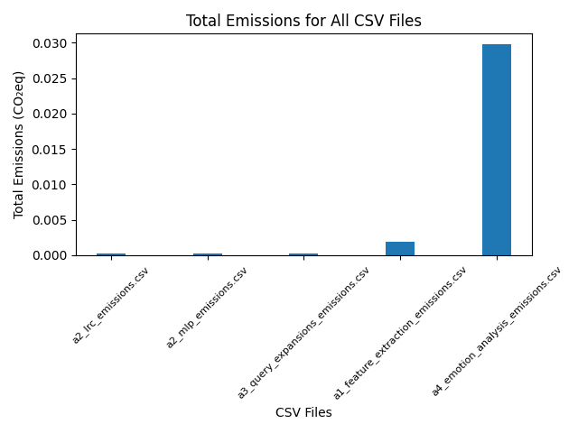
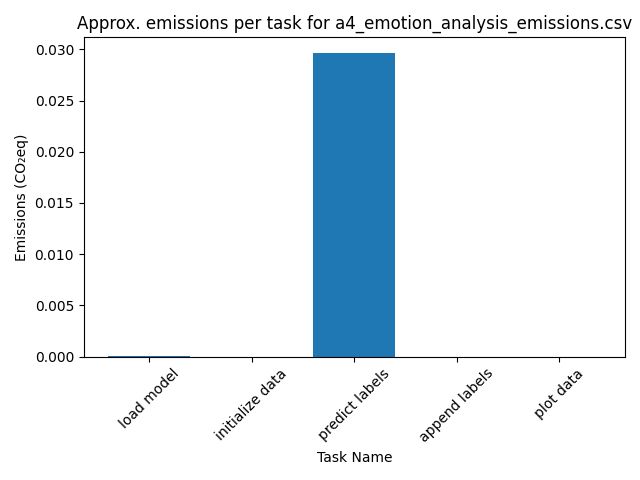
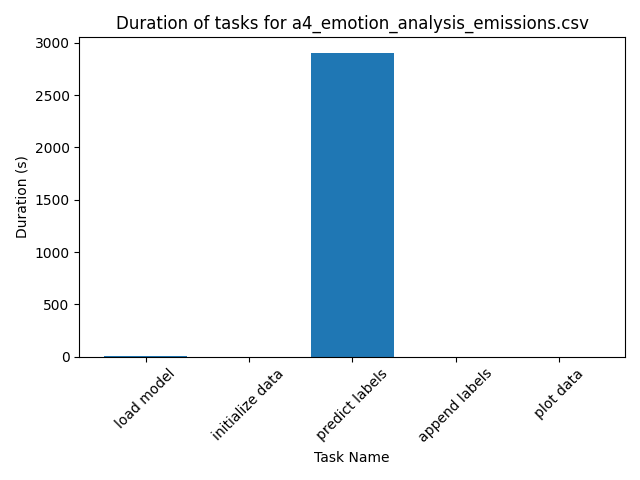

# A5: Evaluating Environmental Impact of Exam Portfolio
## Overview

For this final project, the aim was to consider the environmental impact of machine learning algorithms within the domain of language analytics. To do this, the Python package `CodeCarbon` was implemented in the scripts for all four previous assignments in the Language Analytics course. ``CodeCarbon`` expresses carbon dioxide emissions as kilograms of CO₂-equivalents (CO₂eq) on the basis of measures of [global carbon intensity of electricity per cloud provider or per country](https://mlco2.github.io/codecarbon/methodology.html#carbon-intensity:~:text=When%20available%2C%20CodeCarbon%20uses%20global%20carbon%20intensity%20of%20electricity%20per%20cloud%20provider%20(%20here%20)%20or%20per%20country%20(%20here%20).).

The following code was used to create a tracker object for estimating emissions and power comsumptions of invidual subfunctions of a script:

```python
def function():
    
    tracker = EmissionsTracker(project_name="Project name",     #
                            experiment_id="project_name",       #
                            output_dir=path_out,                #   Initialize tracker object
                            output_file="emissions.csv",        #
                            measure_power_secs=5,               #
                            log_level = "error")                #

    task_name = "task name" # Define task name
    print(f"Starting task: {task_name}")
    tracker.start_task(task_name) # Start subtask
    classifier = load_model() # Subtask itself
    load_model_emissions = tracker.stop_task() # Stop subtask

    # Repeat for all subtasks

    task.stop() # Stop tracking
```
*Code may vary slightly from one script to the next. For the exact code used, please refer to the previous assignment directories.*

To visualize the results, a simple `Python` script loops through the `in` folder containing emissions reports, extracts the columns `task_name`, `duration`, and `emissions`, creates a new colum called `total_emissions` and uses `matplotlib` to plot three bar charts for each file; one showcasing emissions per subtask of each script, one showing the duration of each subtask, and one for the total emissions of the script. These plots are saven to the Please refer to `plot_emissions.py` for an overview of the code.

## Table of Contents

- [Repo Structure](#repo-structure)
- [Data Source and Prerequisites](#data-source-and-prerequisites)
- [Key Points from the Outputs](#key-points-from-the-outputs)
- [Discussion of Limitations and Possible Improvements](#discussion-of-limitations-and-possible-improvements)

## Repo structure

```bash
a5
├── README.md
├── in
│   ├── a1_feature_extraction_emissions.csv
│   ├── a2_lrc_emissions.csv
│   ├── a2_mlp_emissions.csv
│   ├── a3_query_expansions_emissions.csv
│   └── a4_emotion_analysis_emissions.csv
├── out
│   ├── a1_feature_extraction_emissions
│   │   ├── subtask_durations.png
│   │   ├── subtask_emissions.png
│   │   └── total_emissions.png
│   ├── a2_lrc_emissions
│   │   ├── subtask_durations.png
│   │   ├── subtask_emissions.png
│   │   └── total_emissions.png
│   ├── a2_mlp_emissions
│   │   ├── subtask_durations.png
│   │   ├── subtask_emissions.png
│   │   └── total_emissions.png
│   ├── a3_query_expansions_emissions
│   │   ├── subtask_durations.png
│   │   ├── subtask_emissions.png
│   │   └── total_emissions.png
│   ├── a4_emotion_analysis_emissions
│   │   ├── subtask_durations.png
│   │   ├── subtask_emissions.png
│   │   └── total_emissions.png
│   └── all_total_emissions.png
├── requirements.txt
├── run.sh
└── src
    └── plot_emissions.py
```


## Data Source and Prerequisites
The dataset used in this project is a collection of five CSV files containing data about the energy consumption and CO₂eq emissions 
extracted from ``Python`` scripts that were written for the previous assignments in Language Analytics.

The main script was written and executed using ```Python v.1.89.1```. 
For the processing and analysis of the data, the following packages were used:

```
matplotlib==3.9.0
numpy==1.26.4
pandas==2.2.2
codecarbon==2.4.2
```

## Reproducing the Analysis:

To reproduce the analysis, change directory to *a5* and run *run.sh* from the from the terminal:
```bash
cd local_path_to/a5
bash run.sh
``` 
*run.sh* performs the following actions:
1. Sets up a virtual environment called *.venv* in the root directory using ```venv```:
    ```sh
    python -m venv .venv
    ```
2. Activates the environment:
    ```sh
    source .venv/bin/activate
    ```
3. Fetches and installs required dependencies:
    ```
    pip install -r requirements.txt
    ```
4. Runs the main Python script:
    ```
    python src/plot_emissions.py
    ``` 

## Results



By visualising the results of the CodeCarbon tracking, we can create a clear picture of much energy each scripts consumes, and in turn how much CO₂eq they generated. It appears very evident that the by far highest ranked script is the one for assignment 4, the emotion analysis of *Game of Thrones*. The clear sinner in terms of the specific tasks conducted in this script is *predict labels*; Incidentally, this is also by far the most time consuming task of the bunch, as can be seen in the following plots:




In general, for all scripts a clear correlation between the subtask duration and the subtask emissions can be observed. This is to be expected, as the measure of carbon emissions is the product of carbon intensity quantified as g of CO₂ emitted per kilowatt-hour of electricity and energy consumed quantified as kilowatt-hours as per the `CodeCarbon` [documentation](https://mlco2.github.io/codecarbon/methodology.html#carbon-intensity). It is important in this regard to note that the measurements produced by `CodeCarbon` are estimates and ought to be trated as such.

However, this does not mean that meaningful information cannot be extracted from the data. We can regard the results as benchmarks with which we can compare the impact of code and different programming tasks. This is not only potentially useful for optimizing the code, but also speaks to the more significant insight that in terms of conducting data analysis, the most computationally expensive and ressourceful tasks are the ones concerned with machine learning, an important insight due to the fact that artificial intelligence based on extremely complex machine learning algorithms are hastily and steadily becoming more and more mainstream, not only for data analysis, but for entertainment and general purpose usecases. In an era where climate change poses significant challenges, these insights highlight the need for sustainable practices in technology development. By optimizing code and adopting energy-efficient algorithms, we can mitigate the environmental consequences of our digital activities and contribute to a more sustainable future.